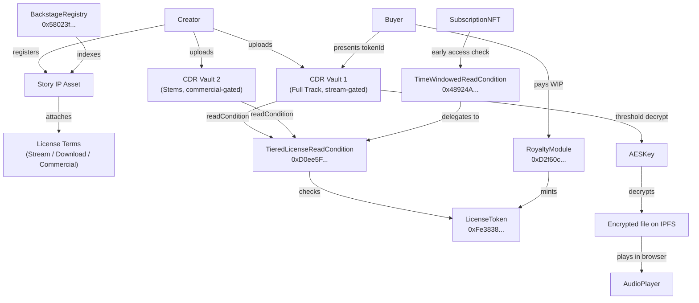

# Backstage

**Where artists keep their unreleased work — and now they can sell access to it directly.**

Backstage is a programmable IP licensing platform built on Story Protocol. Creators upload audio, set tier prices, and their work gets encrypted into CDR vaults gated by Story license tokens. Fans buy a license, the vault unlocks, and the audio plays — all without the creator ever giving away the file.

---

## Tracks targeted

### Technical Implementation ($1,000)
- Custom `TieredLicenseReadCondition` — a CDR read condition that gates each vault to holders of a specific License Terms ID, not just any license for the IP. Three tiers, three term IDs, complete tier isolation proven in 21 Foundry tests.
- Custom `TimeWindowedReadCondition` — wraps any inner condition with a time gate. Subscribers with an ERC-721 pass get early access between `earlyAt` and `releaseAt`; the public unlocks at `releaseAt`. Composable, stateless, reusable across any drop.
- Novel pattern: layered CDR conditions via delegation. `TimeWindowedReadCondition` calls `TieredLicenseReadCondition` — conditions compose, not collide.

### Best CDR Application ($1,000 / runner-up $1,000)
- Real audio encryption and decryption end-to-end on Aeneid testnet
- Full buyer journey: pay → license token minted → CDR vault decrypts → audio plays in browser
- Composable with Story's native IP Asset, License Terms, License Tokens, and Royalty Module

---

## Architecture



---

## Custom condition contracts

### `TieredLicenseReadCondition`

The technical-track centerpiece. Story's built-in `LicenseReadCondition` accepts any license token for a given IP Asset — it doesn't discriminate by tier. This contract adds tier discrimination: it checks that the presented license token was minted for a **specific License Terms ID**, not just any terms attached to the IP.

```solidity
function checkReadCondition(
    uint32 uuid,
    bytes calldata accessAuxData,    // abi.encode(uint256[] tokenIds)
    bytes calldata conditionData,    // abi.encode(address licenseToken, address ipId, uint256 requiredTermsId)
    address caller
) external view returns (bool);
```

**Why this matters:** A creator can put three tiers on one IP Asset and allocate three separate CDR vaults — each vault gets a different `requiredTermsId` in its `conditionData`. A buyer with a Stream license can't unlock the Commercial vault. One stateless contract handles all tier combinations for all IP Assets on the network.

Deployed on Aeneid: [`0xD0ee5Fafff3495100Ca9Df3c4066b94B62F2BF9F`](https://aeneid.storyscan.xyz/address/0xD0ee5Fafff3495100Ca9Df3c4066b94B62F2BF9F)

### `TimeWindowedReadCondition`

Layers time-gated access windows on top of any inner `ICDRReadCondition`. Two windows:

- **Early access** `[earlyAt, releaseAt)` — caller must hold a `subscriptionNft` token
- **Public** `[releaseAt, ∞)` — any caller who satisfies the inner condition

The inner condition is called by delegation, so time gates compose with tier gates without code duplication.

Deployed on Aeneid: [`0x48924A441077f3B03507dB17f35cAd3468756e39`](https://aeneid.storyscan.xyz/address/0x48924A441077f3B03507dB17f35cAd3468756e39)

### `BackstageRegistry`

Catalog contract that links Story IP Assets to CDR vault UUIDs, license terms IDs, and metadata. Emits indexable events for the discovery page.

Deployed on Aeneid: [`0x58023f46a8D1EaC017f07b0A74a5425A613c2f4D`](https://aeneid.storyscan.xyz/address/0x58023f46a8d1eac017f07b0a74a5425a613c2f4d)

---

## How Backstage composes with Story primitives

Backstage does not rebuild any Story Protocol core logic. It builds on top:

| Story primitive | How Backstage uses it |
|---|---|
| IP Asset Registry | Every work becomes an on-chain IP Asset |
| PIL License Terms | Each tier = a separate License Terms ID attached to the same IP Asset |
| License Tokens (ERC-721) | Minted when a buyer pays; presented as `accessAuxData` to CDR vaults |
| Royalty Module | Handles all payment routing; creators receive WIP directly |
| WIP Token | Buyers wrap IP → WIP before minting |

CDR handles content encryption, threshold decryption, and access enforcement. Story handles IP ownership and licensing. Backstage is the glue between them.

---

## Deployed contracts (Aeneid testnet)

| Contract | Address |
|---|---|
| TieredLicenseReadCondition | `0xD0ee5Fafff3495100Ca9Df3c4066b94B62F2BF9F` |
| TimeWindowedReadCondition | `0x48924A441077f3B03507dB17f35cAd3468756e39` |
| BackstageRegistry | `0x58023f46a8D1EaC017f07b0A74a5425A613c2f4D` |
| SubscriptionNFT (demo) | `0x35bd9226Da9b700ad5559e8483f1f1F4Ce7560d9` |
| LicenseToken (Story) | `0xFe3838BFb30B34170F00030B52eA4893d8aAC6bC` |
| RoyaltyModule (Story) | `0xD2f60c40fEbccf6311f8B47c4f2Ec6b040400086` |

---

## Local run

### Prerequisites
- Node.js 22+ (`nvm use 22`)
- pnpm 9+
- Foundry (`curl -L https://foundry.paradigm.xyz | bash`)

### Install
```bash
git clone https://github.com/rehna-jp/backstage
cd backstage
pnpm install
```

### Contracts (tests)
```bash
cd contracts
forge test --summary
```

### Scripts (end-to-end on Aeneid)
```bash
cd scripts
cp .env.example .env   # fill in WALLET_PRIVATE_KEY and BUYER_PRIVATE_KEY
pnpm publish-work      # register IP, encrypt, upload to CDR
pnpm buy-unlock        # mint license, CDR threshold decrypt, write audio
pnpm time-locked-drop  # demonstrate TimeWindowedReadCondition
```

### Web app
```bash
cd web
cp .env.example .env.local   # fill in keys
pnpm dev
# open http://localhost:3000
```

---

## Tests

68 Foundry tests, all passing:

| Suite | Tests |
|---|---|
| TieredLicenseReadConditionTest | 21 |
| TimeWindowedReadConditionTest | 14 |
| BackstageRegistryTest | 16 |
| SubscriptionNFTTest | 17 |

Highlights: fuzz tests on all condition contracts; tier isolation integration test proving a Stream license cannot unlock a Download or Commercial vault.

---

Built for the CDR Hackathon by Story Foundation (May 27 – June 5, 2026).

Powered by [Story Protocol](https://story.foundation) · [CDR](https://docs.story.foundation/developers/cdr-sdk/overview)
